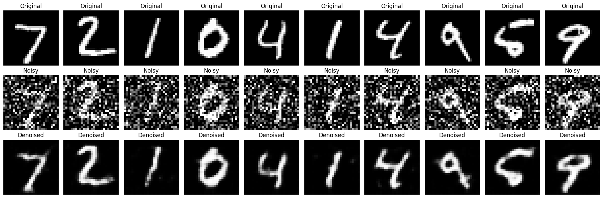

# DL- Convolutional Autoencoder for Image Denoising

## AIM
To develop a convolutional autoencoder for image denoising application.

## Problem Statement and Dataset

This code implements a Denoising Autoencoder using PyTorch to clean noisy images from the MNIST dataset. It uses a convolutional neural network architecture, where the encoder compresses the input image into a lower-dimensional representation, and the decoder reconstructs the original image from this compressed form. To train the model to remove noise, Gaussian noise is added to the clean images, and the network learns to recover the original from the noisy version. The training process uses Mean Squared Error (MSE) as the loss function to measure the reconstruction error and the Adam optimizer to update the model weights. The autoencoder is trained over multiple epochs using mini-batches of data for efficiency. After training, the model's performance is visually evaluated by displaying the original, noisy, and denoised images side by side.


## DESIGN STEPS
### STEP 1: 
Problem Understanding and Dataset Selection

### STEP 2: 
 Preprocessing the Dataset
 
### STEP 3: 
Design the Convolutional Autoencoder Architecture

### STEP 4: 
Compile and Train the Model

### STEP 5 : 
Evaluate the Model

### STEP 6: 
Visualization and Analysis 

## PROGRAM

### Name: SUDHARSAN S

### Register Number:212224040334
```python
# Autoencoder for Image Denoising using PyTorch

import torch
import torch.nn as nn
import torch.optim as optim
from torch.utils.data import DataLoader
from torchvision import datasets, transforms
import matplotlib.pyplot as plt
import numpy as np
from torchsummary import summary

```


```python
# Device configuration
device = torch.device("cuda" if torch.cuda.is_available() else "cpu")

```


```python
# Transform: Normalize and convert to tensor
transform = transforms.Compose([
    transforms.ToTensor()
])
```


```python
# Load MNIST dataset
dataset = datasets.MNIST(root='./data', train=True, download=True, transform=transform)
test_dataset = datasets.MNIST(root='./data', train=False, download=True, transform=transform)

train_loader = DataLoader(dataset, batch_size=128, shuffle=True)
test_loader = DataLoader(test_dataset, batch_size=128, shuffle=False)

```

    100%|██████████| 9.91M/9.91M [00:00<00:00, 60.3MB/s]
    100%|██████████| 28.9k/28.9k [00:00<00:00, 1.67MB/s]
    100%|██████████| 1.65M/1.65M [00:00<00:00, 14.7MB/s]
    100%|██████████| 4.54k/4.54k [00:00<00:00, 11.8MB/s]
    


```python
# Add noise to images
def add_noise(inputs, noise_factor=0.5):
    noisy = inputs + noise_factor * torch.randn_like(inputs)
    return torch.clamp(noisy, 0., 1.)

```


```python
class DenoisingAutoencoder(nn.Module):
    def __init__(self):
        super(DenoisingAutoencoder, self).__init__()
        self.encoder = nn.Sequential(
            nn.Conv2d(1, 16, kernel_size=3, stride=2, padding=1),
            nn.ReLU(),
            nn.Conv2d(16, 32, kernel_size=3, stride=2, padding=1),
            nn.ReLU(),

        )
        self.decoder = nn.Sequential(
            nn.ConvTranspose2d(32, 16, kernel_size=3, stride=2, padding=1, output_padding=1),
            nn.ReLU(),
            nn.ConvTranspose2d(16, 1, kernel_size=3, stride=2, padding=1, output_padding=1),
            nn.Sigmoid()
        )


    def forward(self, x):
        x = self.encoder(x)
        x = self.decoder(x)
        return x
```


```python
# Initialize model, loss function and optimizer
model = DenoisingAutoencoder().to(device)
criterion =nn.MSELoss()
optimizer =optim.Adam(model.parameters(), lr=1e-3)
```


```python
 # Print model summary
summary(model, input_size=(1, 28, 28))
```
```
    ----------------------------------------------------------------
            Layer (type)               Output Shape         Param #
    ================================================================
                Conv2d-1           [-1, 16, 14, 14]             160
                  ReLU-2           [-1, 16, 14, 14]               0
                Conv2d-3             [-1, 32, 7, 7]           4,640
                  ReLU-4             [-1, 32, 7, 7]               0
       ConvTranspose2d-5           [-1, 16, 14, 14]           4,624
                  ReLU-6           [-1, 16, 14, 14]               0
       ConvTranspose2d-7            [-1, 1, 28, 28]             145
               Sigmoid-8            [-1, 1, 28, 28]               0
    ================================================================
    Total params: 9,569
    Trainable params: 9,569
    Non-trainable params: 0
    ----------------------------------------------------------------
    Input size (MB): 0.00
    Forward/backward pass size (MB): 0.13
    Params size (MB): 0.04
    Estimated Total Size (MB): 0.17
    ----------------------------------------------------------------
    
```

```python
# Train the autoencoder
def train(model, loader, criterion, optimizer, epochs=5):
      model.train()
      print("Name:          SUDHARSAN S         ")
      print("Register Number:    212224040334      ")
      for epoch in range(epochs):
        running_loss = 0.0
        for images, _ in loader:
            images = images.to(device)
            noisy_images = add_noise(images).to(device)
            outputs = model(noisy_images)
            loss = criterion(outputs, images)
            optimizer.zero_grad()
            loss.backward()
            optimizer.step()
            running_loss += loss.item()
        print(f"Epoch [{epoch + 1}/{epochs}], Loss: {running_loss / len(loader):.4F}")


```


```python
# Evaluate and visualize
def visualize_denoising(model, loader, num_images=10):
    model.eval()
    with torch.no_grad():
        for images, _ in loader:
            images = images.to(device)
            noisy_images = add_noise(images).to(device)
            outputs = model(noisy_images)
            break

    images = images.cpu().numpy()
    noisy_images = noisy_images.cpu().numpy()
    outputs = outputs.cpu().numpy()

    print("Name:SUDHARSAN S           ")
    print("Register Number:212224040334        ")
    plt.figure(figsize=(18, 6))
    for i in range(num_images):
        # Original
        ax = plt.subplot(3, num_images, i + 1)
        plt.imshow(images[i].squeeze(), cmap='gray')
        ax.set_title("Original")
        plt.axis("off")

        # Noisy
        ax = plt.subplot(3, num_images, i + 1 + num_images)
        plt.imshow(noisy_images[i].squeeze(), cmap='gray')
        ax.set_title("Noisy")
        plt.axis("off")

        # Denoised
        ax = plt.subplot(3, num_images, i + 1 + 2 * num_images)
        plt.imshow(outputs[i].squeeze(), cmap='gray')
        ax.set_title("Denoised")
        plt.axis("off")

    plt.tight_layout()
    plt.show()

```


```python
# Run training and visualization
train(model, train_loader, criterion, optimizer, epochs=5)
visualize_denoising(model, test_loader)
```
```
    Name:          SUDHARSAN S         
    Register Number:    212224040334      
    Epoch [1/5], Loss: 0.0139
    Epoch [2/5], Loss: 0.0138
    Epoch [3/5], Loss: 0.0136
    Epoch [4/5], Loss: 0.0134
    Epoch [5/5], Loss: 0.0133
    Name:SUDHARSAN S           
    Register Number:212224040334        
    
```

    

    


### OUTPUT

### Model Summary


### Training loss


## Original vs Noisy Vs Reconstructed Image


## RESULT
Therefore, To develop a convolutional autoencoder for image denoising application executed successfully.
